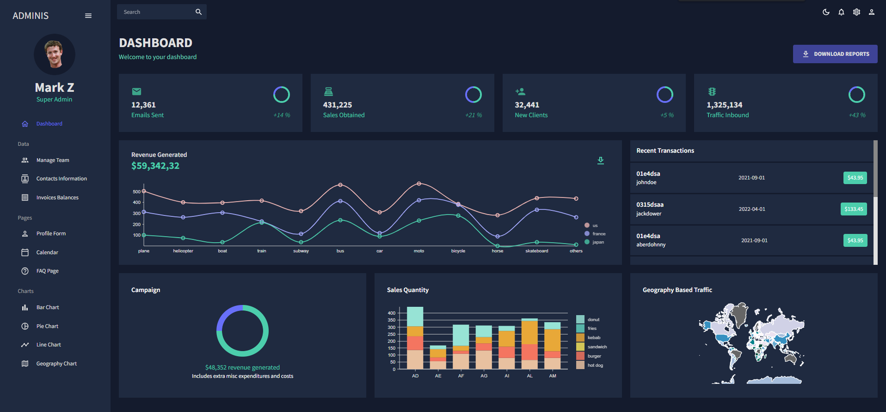

# Admin Dashboard Project

This project represents an admin dashboard with many subpages, where user can for example check charts, add events to calendar or export tables. User can also easily switch between the light and the dark modes. 

Project was written in JavaScript with the use of React, MaterialUI, NivoChart and FullCalendar.

